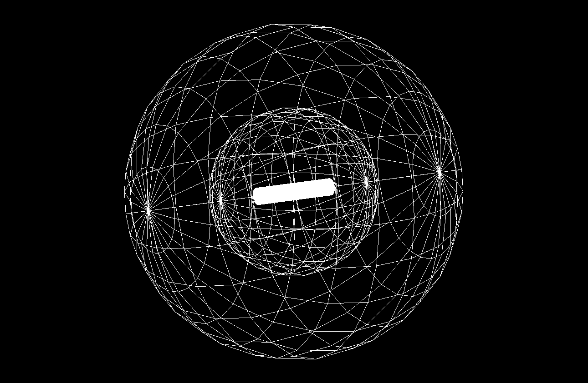
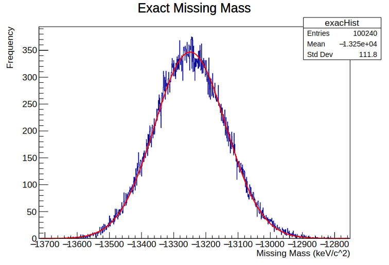
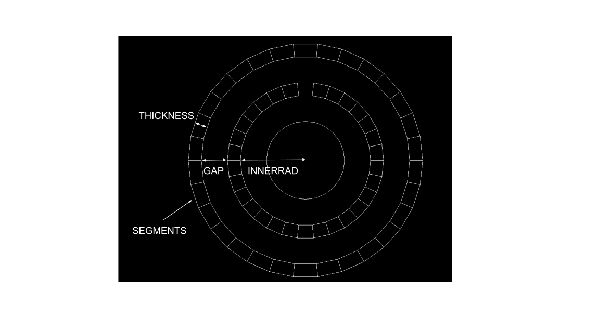
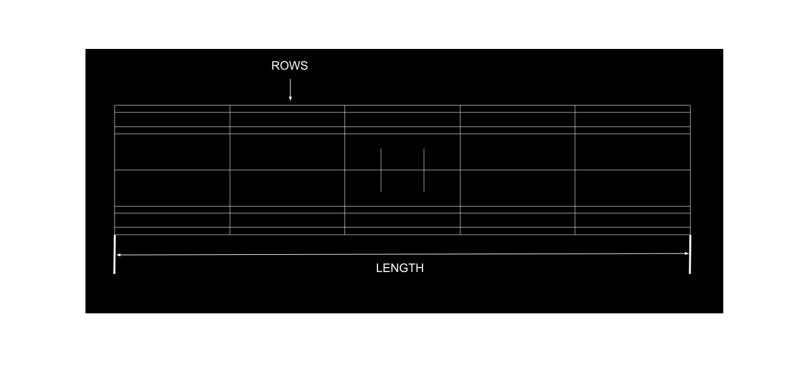

# Geant4-P2P-Investigation

My University of York Theoretical Physics BSc dissertation and accompanying code, investigating the optimal detector system for utilising a (p,2p) interaction when determining the proton binding energy within Carbon-12 atoms.

## Project Description

### Dissertation abstract

A particle detector was designed to make use of the quasi-free (p,2p) knockout reaction in
order to probe the observables of protons in the Carbon-12 nucleus and simulated using the
[Geant4](https://geant4.web.cern.ch/) framework. This report will be beneficial in making design choices at [R3B](https://www.gsi.de/work/forschung/nustarenna/nustarenna_divisions/kernreaktionen/activities/r3b), at which a
physical detector is being developed for similar purposes. The detector system is made up of
two silicon cylindrical layers surrounded by a spherical silicon calorimeter. To investigate the
proficiency of the detector, the missing mass reconstruction was calculated using the outgoing
proton’s 4-momentum vectors. Dimensions tested are the length of the cylinders, the gap
between them and their thickness, as well as the thickness of the calorimeter. An optimal
detector for this situation would be at least 80 cm long, have a gap of 3 cm, a layer thickness
of 0.01 mm or less, and a calorimeter of 160 cm, giving a detector with an 85% efficiency. - [Link to full paper](ConnerGriceFinalDissertation.pdf)



### Program overview

The main purpose of this program is to simulate how 2 protons generated during the (p,2p) reaction move through materials. Specific particle properties are recorded in a digitised way to simulate real-world detectors. This data is then used to calculate the protons momentum, and then used to calculate the binding energy of the Carbon-12 atom the protons originated from (analogous to the missing mass).



The main program can either be viewed within a visualiser, or multiple simulations can be carried out consecutively within the terminal.

The simulations will result in a data file being produced, that can be converted into a histogram or scatter plots.


Multiple scripts are used to automate the simulation and experimentation workflow. Through these experiments, different detector parameters can be fine tuned to get the best results. These parameters include:

- Detector length
- Detector thickness
- Space between detector cylinders
- Thickness of the calorimeter

 More information can be found [here](#usage).

This program makes use of the [Geant4](https://geant4.web.cern.ch/) framework as well as the [ROOT analytics](https://root.cern/) framework.

Geant4 is produced by CERN and makes use of [Monte Carlo simulations](https://en.wikipedia.org/wiki/Monte_Carlo_method) in order to simulate how particles would behave while traveling through different mediums. Geant4 comes with the capabilities to generate 3D geometry as well as a visualiser.

ROOT Analytics is another open-source framework created by CERN for specific use within high energy particle physics. Its primary use is for data analytics. The main feature is the tree-based file system `.root`. These are C++ objects that can be saved and can contain many columns within them.

## Installation

This whole project was done using a [virtual machine](https://indico.cern.ch/event/865808/page/19021-geant4-virtual-machine) provided by CERN, using VMWare. The machine had dependencies already compiled and working.

It seems that this virtual machine is no-longer available for download, so basic dependencies and versions are given below.

|Package|Version|Link|
---:|:---:|:---
Geant4|`10.7.2`|[Download](https://geant4.web.cern.ch/support/download)
ROOT Analytics|`6.18/04`|[Download](https://root.cern/install/)
CLHEP|`2.4.4.0`|[Download](https://gitlab.cern.ch/CLHEP/CLHEP)

Once the dependencies are installed, the program can be built and compiled. First, clone this repository into you desired directory:

```sh
git clone https://github.com/ConnerGrice/Geant4-P2P-Investigation.git
```

Once cloned, move into the `build/` directory and build the program using:

```sh
cmake -DGeant_DIR=$G4COMP ..
```

**Note:** `$G4COMP` is a variable set by the virtual machine, the path this variable corresponds to is, `geant4.10.07.p02/lib64/Geaant-10.7.2`, which represents the directory Geant4 is built into.

Once the CMake file have been created, compile the program using:

```sh
make
```

The `p2p.exe` should now be available in your `build/` directory.

## Usage

Before running any experiments, make sure all the parameters are set to the desired values. The parameters can be found in `classes/dimensions.h`.

Dimension|Description
---|---
`LENGTH`| The length of both cylinders.
`GAP`| The gap between cylinders.
`THICKNESS`| The thickness of both cylinders.
`SEGMENTS`| The number of radial segments in each section along both cylinders.
`ROWS`| The number of sections along both cylinders.
`INNERRAD`| The radius of the inner cylinder.
`CALTHICKNESS`| The thickness of the spherical calorimeter surrounding the detector.





The program can be used in multiple different ways. Carrying out a [single run](#single-run) using the visualiser; a [single experiment](#single-experiment), which consists of 100240 runs; or [multiple experiments](#multiple-experiments), where a parameter is changed according to a specific [script](#scripts).

### Single Run

To initiate the visualiser, use:

```sh
./p2p
```

This will use the `init_vis.mac` macro, which will call the `vis.mac` macro. The `init_vis.mac` macro should be unedited, however, `vis.mac` can be used to change some effects within the visualiser. For example:

```
/vis/viewer/set/viewpointVector 0 0 0
/vis/viewer/set/lightsVector -1 0 0
```

`/vis/viewer/set/viewpointVector` can be used to change the initial position of the camera when the visualiser first loads. The 3 values after the command are the 3D coordinates of the camera. `/vis/viewer/set/lightsVector` is the position of the light source. The 3 values after this command is the 3D unit vector that corresponds to the direction the light source is pointing.

Some commands may need to specify a geometric object to target, for example:

```
/vis/geometry/set/visibility World 0 false
```

In the code above, `World` is the name of an objects in the scene. There are other objects. These objects can be found in `classes/p2pDetectorConstruction.cpp`.

Object Name|Description
---|---
`World`| The entire scene, where all other objects are generated inside of.
`Calorimeter`| The sphere surrounding the detector cylinders.
`Emission`| The small cuboid that simulates the surface that particles original from.
`Inner`| The inner, smaller detector cylinder.
`Outer`| The outer, larger detector cylinder.

More visualiser commands can be found [here](http://www.hep.ph.ic.ac.uk/~yoshiu/COMET/comet_g4HTMLdoc/_vis_.html).

Once the visualiser is running, generate a pair of particles using the command `/run/beamOn 1`. This will use the data from the first entry in the `quasi.root` file provided. Each proceeding run of the command will use the next entry in the file.  

### Single Experiment

A single experiment can be carried out using:

```sh
./p2p run.mac
```

This will make the program use the `run.mac` macro and run the program 100240 times, using all the data in the `quasi.root` file. Due to the increased number of runs, this will be done in batch mode. Batch mode means that the visualiser is not launched and everything is printed into the terminal.

The `run.mac` macro can be edited. The only commands that should be changed if needed:

```
/control/verbose 0
/run/verbose 1
/event/verbose 0
/tracking/verbose 0
```

These will change the type of data that is printed into the terminal as the program is executed.

Once all 100240 runs have been completed and the program stops, a new file containing all the experiment data will have been generated, `build/data.root`. This data can now be processed using:

```sh
root missingmass.cpp
```

This will generate a new file, `figs/missing.root`, which will contain all the missing mass calculation data. ROOT can then be exited with `.q`.

Next, by using `plotprinter.cpp`:

```sh
root plotprinter.cpp
```

A `.png` image along with a `.eps` vector image can be generated. More information on [`missingmass.cpp`](#missingmasscpp) and setting up [`plotprinter.cpp`](#plotprintercpp) can be found.

### Multiple Experiments

The program can be run like this using the one of many [shell scripts](#experimentation-scripts) provided. All of these scripts act in very similar ways. They carry out an experiment, change some parameter, put the results into a different directory, then run the experiment again.

These scripts can be run using:

```sh
./name_of_shell_script.sh
```

Once the script is finished, there should be a number of `.root` files in the corresponding directory. The next step is to use the corresponding [collection script](#collection-scripts) to assemble the individual experiments together into a single plot for analysis. These collection scripts can be run using:

```sh
root name_of_collection_script.cpp
```

The shell scripts and corresponding collection scripts are as follows:

Script|Default Process|Results Directory|Collection Script
---|---|---|---
`thickness.sh`|`THICKNESS` from 0.01mm to 1mm in 0.01mm steps|`figs/thickness/`|`thicknesscollection.cpp`
`length.sh`|`LENGTH` from 51cm to 80cm in 1cm steps|`figs/lengths/`|`lengthcollection.cpp`
`gap.sh`|`GAP` from 0.1cm to 5cm in 0.1cm steps|`figs/gaps/`|`gapcollection.cpp`
`energycomp.sh`|`CALTHICKNESS` from 80cm to 200cm in 5cm steps|`figs/energy/`| N/A

The shell scripts can be edited to change the range through which the parameters are changed. More information about this can be found [here](#experimentation-scripts). The collection scripts can also be edited in order to change the type of data that is plotted. More information can be found [here](#collection-scripts)

## Scripts

### exacmass.cpp

This script is used to generate a benchmark missing mass distribution using the initial values given by `quasi.root`. The script is run using:

```sh
root exacmass.cpp
```

After the script has run, it will output the results into `figs/ExactMass.root` file, a `figs/ExactMass.png` image, and a `figs/ExactMass.eps` vector image.

The script itself is quite simple. After fetching the data from `quasi.root`, it will go through each line, extracting the momentum and energy information for each proton, then calculate the loss in momentum between those protons and the original Carbon-12 atom.

```cpp
//Read until all the data has been read
while (reader.Next()){

  //Momentum 4-vectors
  P1 = TLorentzVector(*P1x,*P1y,*P1z,*E1);
  P2 = TLorentzVector(*P2x,*P2y,*P2z,*E2);

  //Calculates the momentum values
  momOut = P1 + P2;
  momInit = ltarget + lbeam;
  momMiss = momInit-momOut;

  missing = momMiss.M()-fragM;
  std::cout<<missing<<std::endl;

  //Fills histogram with data
  exacHist->Fill(missing);
}
```

The resulting distribution is then fitted to a Gaussian curve for visualisation.

### missingmass.cpp

This script is used to generate a missing mass distribution based on the readings the detector gathered during one experiment of 100240 runs. After an experiment has been completed, and the `build/data.root` file has been generated, the script can be run:

```sh
root missing.root
```

After the script has been completed, the results will be output into `figs/missing.cpp`.

The data collected by the simulation is as follows; a tag for the inner and outer cylinders that indicates whether that particle successfully hit that cylinder (-1 if they missed); the simulation counter/ID; and the x,y, and z position of the particle as it passes through each cylinder. This data is collected for both of the particles during each simulation.

The complexity comes from the fact that during some runs of the simulation, the detector may not have been able to collect all the data needed for the missing mass calculations. Therefore, it is the job of this script to parse through all the data and remove those instances.

```cpp
for(int i=0;i<(int)(data.size()/2);i++){
  //Checks if ANY particle missed ANY of the detectors
  if (data[2*i][0] != -1 && data[2*i][1] != -1 && data[2*i+1][0] != -1 && data[2*i+1][1] != -1){

    eventMom.clear();
    //Loops though the pair of particles for each event that has no misses
    for (int j=0;j<2;j++){

      //Displacement 3-vector of particle
      TVector3 mom = {data[2*i+j][6]-data[2*i+j][3],
              data[2*i+j][7]-data[2*i+j][4],
              data[2*i+j][8]-data[2*i+j][5]};

      //Converts displacement to momentum 4-vector
      //Checks if particle 1
      if (data[2*i+j][0]==1){
        p = momentum(allEnergy[i][0],proM);
        pRand = r3.Gaus(p,p*FWHW);
        mom = pRand*mom.Unit();
        lmom.SetPxPyPzE(mom.x(),mom.y(),mom.z(),allEnergy[i][0]);
      }
      //Checks if particle 2
      if (data[2*i+j][0]==2){
        p = momentum(allEnergy[i][1],proM);
        pRand = r3.Gaus(p,p*FWHW);
        mom = pRand*mom.Unit();
        lmom.SetPxPyPzE(mom.x(),mom.y(),mom.z(),allEnergy[i][1]);
      }
      eventMom.push_back(lmom);

    }
    //Calculates total final 4-momentum
    TLorentzVector momOut = eventMom[0] + eventMom[1];
    //Calculates missing mass 4-momentum
    missingMom = momIn - momOut;
    //Calculates missing mass
    missingMass = missingMom.M()-fragM;
    std::cout<<"Missing Mass: "<<missingMass<<std::endl;
    //Puts value into histogram
    missHist->Fill(missingMass);

    hitEvent++;
  }
  event++;
}
```

In order to filter the data, the script first checks if both particles hit both cylinders; `if (data[2*i][0] != -1 && data[2*i][1] != -1 && data[2*i+1][0] != -1 && data[2*i+1][1] != -1)`. If both particles did hit both cylinders, the next step is to use the collected data to calculate the momentum of both of the particles during that simulation and put it into the distribution.

### energycomp.cpp

This script is used to compare the energy measured by the detector with the exact energy given by the `quasi.root` data. The script can be run using:

```sh
root energycomp.cpp
```

The script will generate both `figs/energycomp.root` and `figs/energycomp.eps`. These plots will be scatter plots. The user can choose whether to plot the data comparing the energies of either particle by modifying:

```cpp
//Graph containing particle 1 data
TGraph* E1 = new TGraph(n,allCalcE1,allExactE1);
E1->SetTitle("");
E1->GetXaxis()->SetTitle("Calorimeter Energy (MeV)");
E1->GetYaxis()->SetTitle("Exact Energy (MeV)");
```

Change `allCalcE1` and `allExactE1` to `allCalcE2` and `allCalcExactE2` respectively. The title and axis title can also be changed.

### plotprinter.cpp

This is a simple script to allow the user to convert an already generated `.root` canvas into `.png` or `.eps` format.

To set up this script, the user must modify:

```cpp
//File name of canvas you want to save as an image
std::string file = "figs/ExactMass";

//Name of the plot
std::string plotName = "c1_n2";
```

`file` should be changed to the path to the `.root` file that you want to convert, but without including `.root`. `plotName` should be changed to the name of the histogram/canvas within the `.root` file that you want to convert.

Once these have been changed, the script can be run using:

```sh
root plotprinter.cpp
```

### Experimentation scripts

These are the multiple shell scripts that carry out multiple experiments while changing a specific variable. They all follow the same structure, for example, the shell script that varies the thickness of the cylinders between experiments:

```sh
#!/bin/bash

suffix=1 
for value in $(seq 0.01 0.01 1.0);
do 
  sed -i 's/const G4double THICKNESS = .*/const G4double THICKNESS = '"$value"'*mm;/g' classes/dimensions.h
  cd build
  make
  ./p2p run.mac
  cd ..
  root -q missingmass.cpp
  cp -v figs/missing.root figs/thickness/$suffix.root
  echo $suffix
  ((suffix++))
done

echo ALL done
```

It is a simple `for` loop that goes through all the parameter values, edits the dimension in `classes/dimensions.h`, recompiles and runs the program. Once the experiment is finished, the missing mass is generated using the `missingmass.cpp` script. The output of that script is then moved to the specific directory where all the experiments are stored.

The script is then run using:

```sh
./thickness.sh
```

The range and steps taken in the experiments can be changed by the user with a simple edit to the script.

```sh
$(seq value1 value2 value3);
```

Where `value1` is the value of the parameter for the first experiment, `value2` is the value of the parameter by the end of all experiments, and `value3` is the step size the parameter changes by between each experiment. However, if the user changes this range, the corresponding collection script must also be edited, e.g. `thicknesscollection.cpp`:

```cpp
//Number of experiments
Int_t start = value1;  //Starting parameter
Int_t end = value2;  //Final parameter

...

for (int i=start;i<=end;i = ++value3){
  //Some code
}
```

### Collection scripts

The purpose of these scripts are to take all the data from each experiment, placed into the corresponding directory by the experiment scripts and generate a new plot visualising how the characteristics of the missing mass distribution changes as the parameter is changed.

All of these scripts follow a similar structure. For example, `thicknesscollection.cpp` will start to loop through each file within the `figs/thickness/` directory, fit a gaussian curve over the top of those histograms, and record the mean and standard deviation of that Gaussian, as well as the ratio of successful runs within the simulation (Runs where both particles hit both cylinders). This data is then placed into plots of their own and output as `.png` and `.eps` files.

Before running the script, the user can choose which data to plot, e.g. the change in mean, standard deviation, and efficiency. This is done by commenting out some code and uncommenting other pieces.

```cpp
//Mean missing mass
TGraph* dets = new TGraph(n,lengths,meanCollection);
dets->SetTitle("");
dets->GetXaxis()->SetTitle("Length of cylindrical Detectors (cm)");
dets->GetYaxis()->SetTitle("Mean missing mass (keV/c^2)");
dets->SetMarkerStyle(7);
dets->Draw("acp");
dets->SaveAs("figs/collections/length_mass.root");

c1->SetRightMargin(0.09);
c1->SetLeftMargin(0.15);
c1->Print("figs/collections/length_mass.eps");
c1->Print("figs/collections/length_mass.png");
```

This section of code will generate the plot using the mean values. The sections that generate using the standard deviation or the efficiency is just below this.

The script is then run using:

```sh
root thicknesscollection.cpp
```
